# Endpoint Descriptions

## Parameter Route
## Base URL: IP_address:port_num/logdata
### (1) /obd2param/list
Method: GET
- Input: None
- Output: A JSON object named 'data', containing an array of 'obd2param' objects, with default max number of objects

### (2) /obd2param/list/:num
Method: GET
- Input: HTTP Param, num
- Output: A JSON object named 'data', containing an array of 'obd2param' objects, with the specified max 'num' of objects.

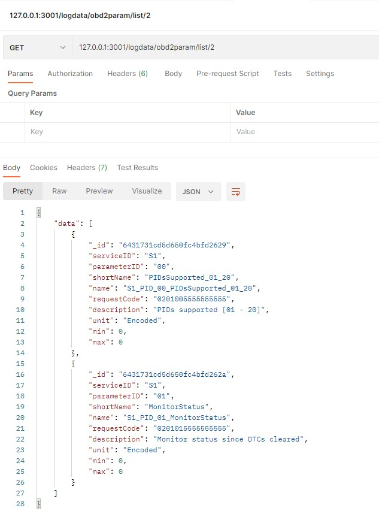

### (3) /obd2param/id/:id
Method: GET
- Input: HTTP Param id
- Output: A JSON object named 'data', containing the obd2param object with the specified 'id'. Note: This id the '_id' of mongoDB.

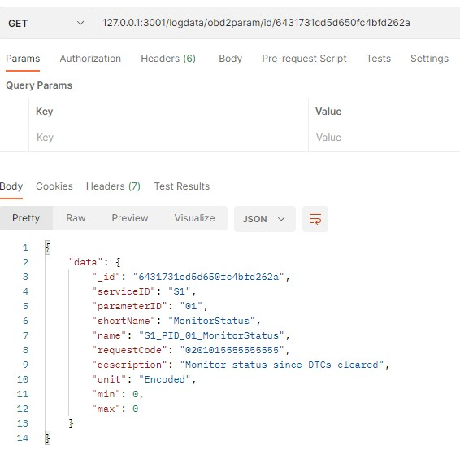

### (4) /obd2param/name/:name
Method: GET
- Input: HTTP Param name
- Output: A JSON object named 'data', containing the obd2param object with the specified 'name'. Note: This 'name' is as defined the schema, i.e., parameter name with service ID and parameter ID includes (example: "S1_PID_03_FuelSystemStatus").

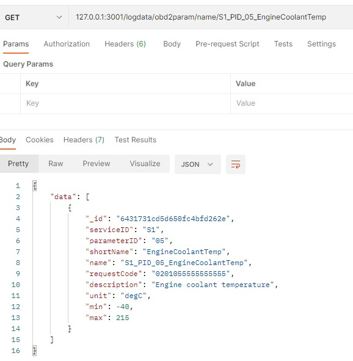

### (5) /obd2param/create
Method: POST
- Input: JSON object of obd2param schema in the body of the request
- Output: An URL pointing directly to the newly created object.

### (6) /obd2param/update
Method: POST
- Input: JSON object of obd2param schema in the body of the request. The object must have the _id artribute 
- Output: An URL pointing directly to the updated object.

### (7) /obd2param/delete/:id
Method: GET
- Input: HTTP Param, id 
- Output: Simple message, "Parameter deleted".

---
## Vehicle Route
### Base URL: IP_address:port_num/logdata/vehicle
#### (1) /vehicle/list
Method: GET
Input: None
Output: A JSON object named 'data', containing an array of 'vehicle' objects, with default max number of objects

### (2) /vehicle/list/:num
Method: GET
Input: HTTP Param num
Output: A JSON object named 'data', containing an array of 'vehicle' objects, with the specified max 'num' of objects

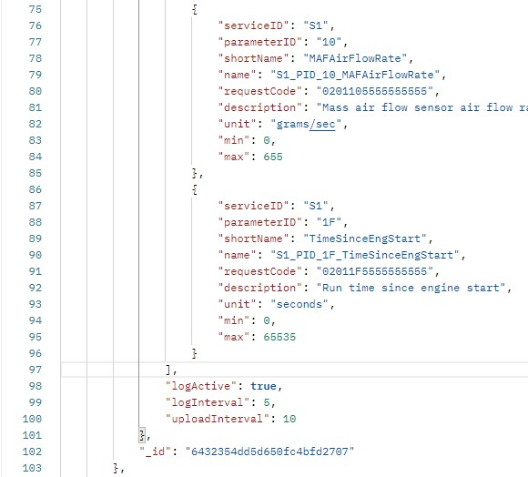

### (3) /vehicle/id/:id
Method: GET
Input: HTTP Param id
Output: A JSON object named 'data', containing the vehicle object with the specified 'id'. Note: This id the '_id' of mongoDB.

### (4) /vehicle/vin/:vin
Method: GET
Input: HTTP Param vin
Output: A JSON object named 'data', containing the obd2param object with the specified 'vin'. 

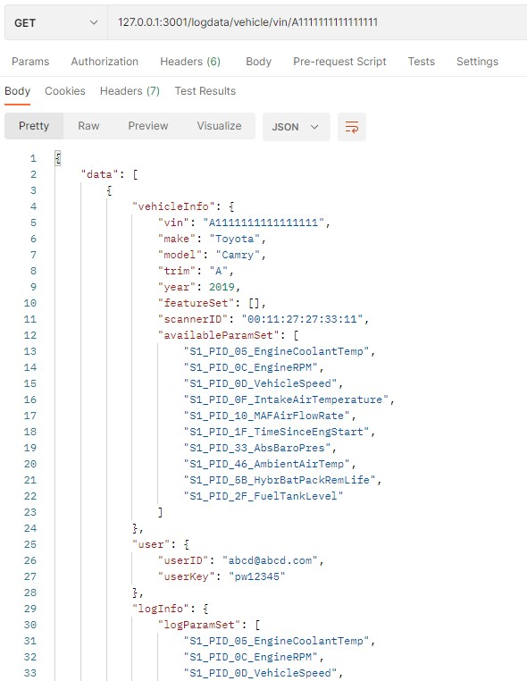

### (5) /vehicle/loginfo/:vin
Method: GET
Input: HTTP Param vin
Output: A JSON objects named 'logParamSet' and 'logActive', containing the correspoinging values of 'vehicle' object with the specified 'vin'. 

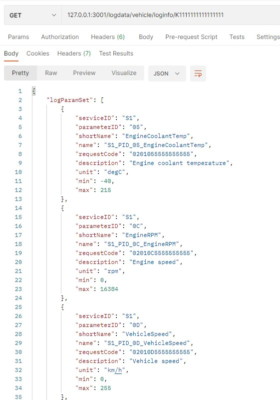
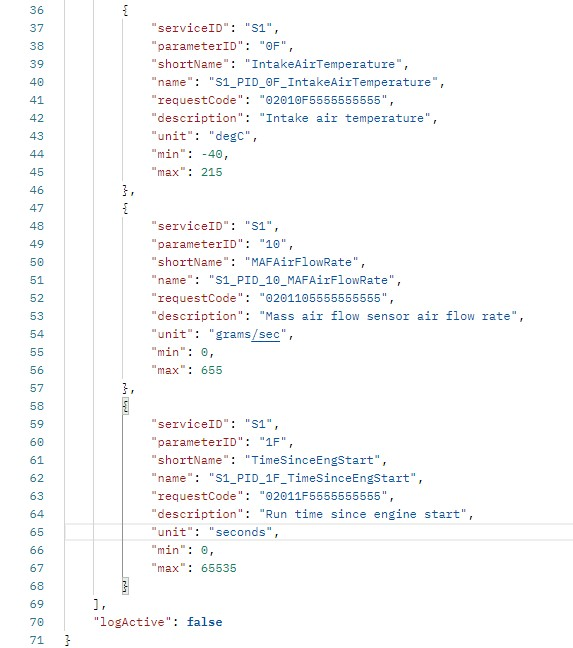

#### (6) /vehicle/create
Method: POST
Input: JSON object of vehicle schema in the body of the request; The logParamSet array needs to have only the name attibute filled; the other attributes for the corresponding parameter name will be filled by the server.
Output: An URL pointing directly to the newly created object.

#### (7) /vehicle/update
Method: POST
Input: JSON object of vehicle schema in the body of the request. The object must have the _id artribute. The logParamSet array needs to have only the name attibute filled; the other attributes for the corresponding parameter name will be filled by the server.
Output: An URL pointing directly to the updated object.

#### (8) /vehicle/delete/:id
Method: GET
Input: HTTP Param, id 
Output: Simple message, "Vehicle deleted".

#### (9) /vehicle/availparams/:vin
Method: POST
Input: 
    HTML param: vin 
    Body: Array of string containing the names of avaialble paramters in the vehicle
Output: An URL pointing directly to the updated object.

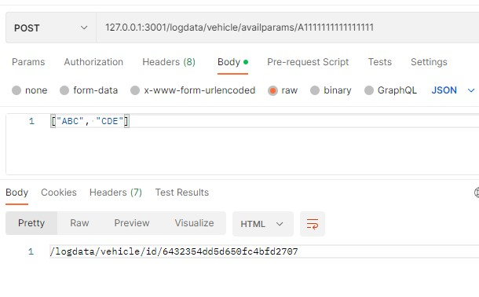
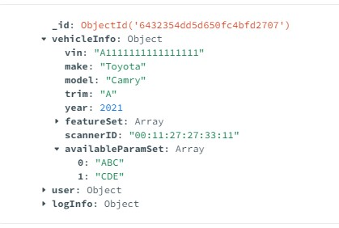

---
## OBD2 Time Series Route
## Base URL: IP_address:port_num/logdata
### (1) /obd2ts/list
Method: GET
- Input: None
- Output: A JSON object named 'data', containing an array of 'obd2ts' objects, with default max number of objects

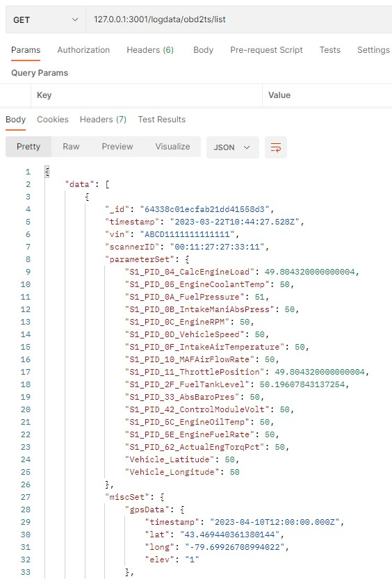
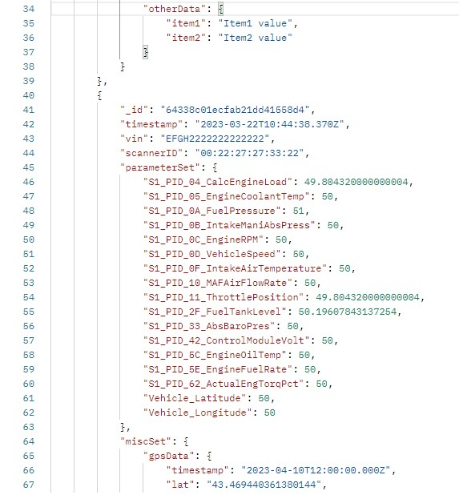

### (2) /obd2ts/list/:num
Method: GET
- Input: HTTP Param, num
- Output: A JSON object named 'data', containing an array of 'obd2ts' objects, with the specified max 'num' of objects.

### (3) /obd2ts/id/:id
Method: GET
- Input: HTTP Param id
- Output: A JSON object named 'data', containing the obd2ts object with the specified 'id'. Note: This id the '_id' of mongoDB.

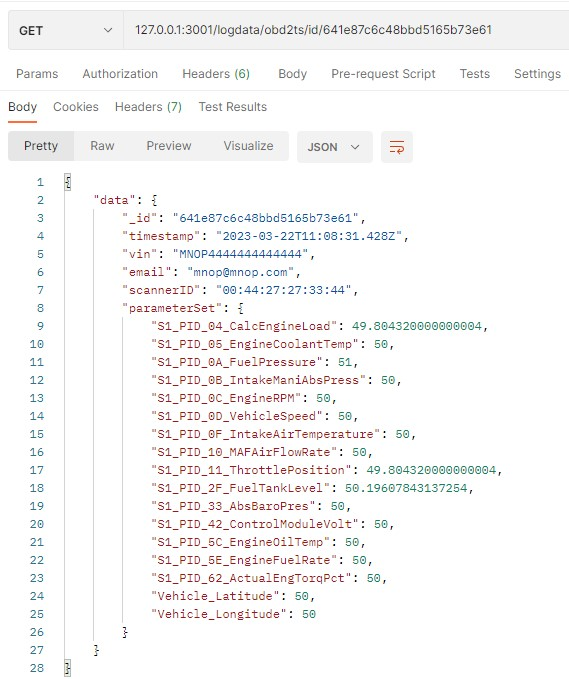

### (4) /obd2ts/vin/:vin
Method: GET
- Input: HTTP Param `vin`
- Output: A array of JSON objects named 'data', containing the obd2ts objects with the specified 'vin', with default max number of records

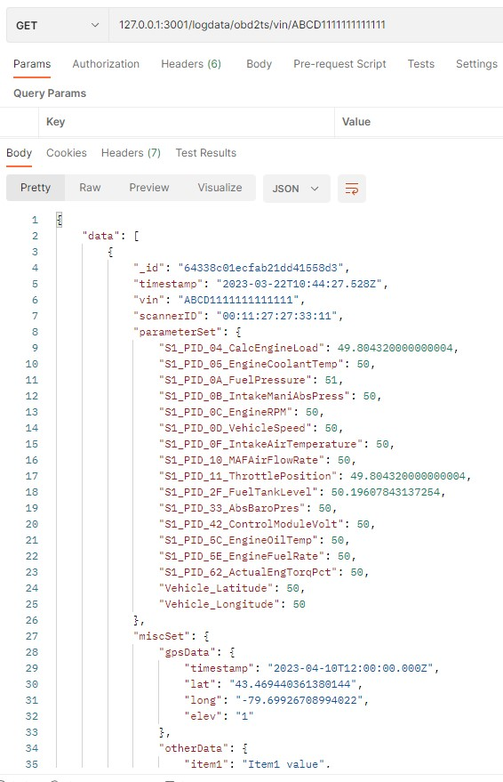

### (5) /obd2ts/vin/:vin/num/:num
Method: GET
- Input: HTTP Param `vin`, `num`
- Output: A array of JSON objects named 'data', containing the obd2ts objects with the specified 'vin', with max `num` of records

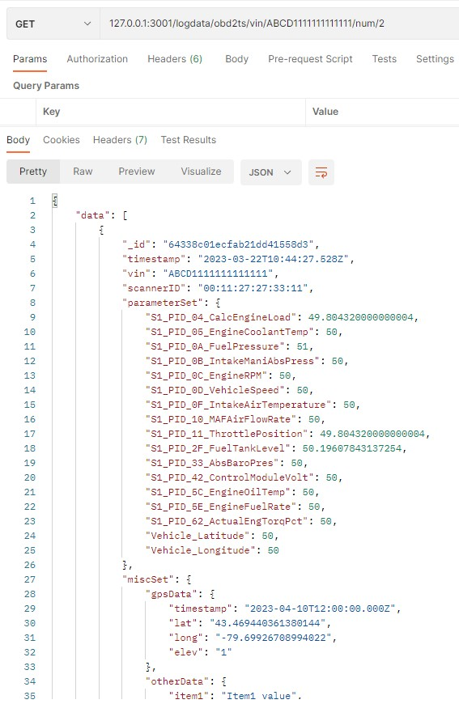

### (6) /obd2ts/vin/:vin/timestamp/:timestamp/num/:num
Method: GET
- Input: HTTP Param `vin`, `timestamp`, `num`
- Output: A JSON object named 'data', containing the obd2ts object with the specified 'vin', and exact timestamp, with max `num` of records. Note: Timestamp should be in ISO 8601 format. Refer to the resrouces below.
1. [Date Time Format](https://www.w3.org/TR/NOTE-datetime)
2. [Javascript Date string conversion](https://developer.mozilla.org/en-US/docs/Web/JavaScript/Reference/Global_Objects/Date/toISOString)
3. [ISO 8601](https://en.wikipedia.org/wiki/ISO_8601)

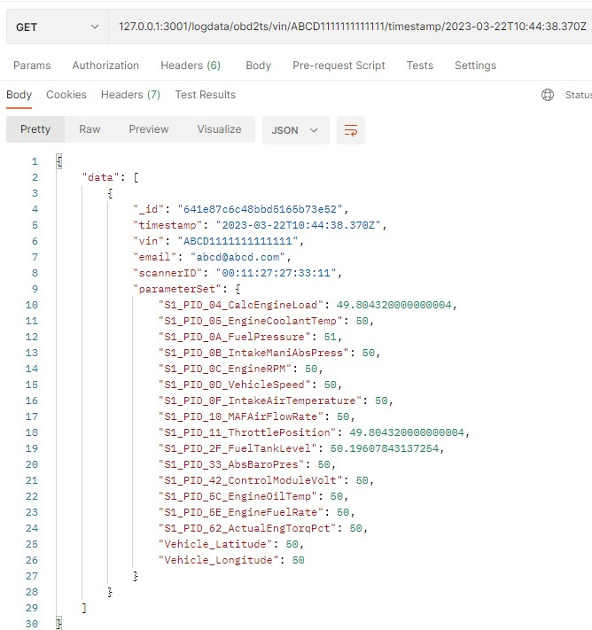

### (7) /obd2ts/vin/:vin/starttime/:starttime/endtime/:endtime
### (8) /obd2ts/vin/:vin/starttime/:starttime/endtime/:endtime/num/:num
Method: GET
- Input: HTTP Param `vin`, `starttime`, `endtime`, `num`
- Output: A JSON object named 'data', containing an array of obd2ts objects that are recorded within the time range, with the specified 'vin'. `num` limits the number of records returned.

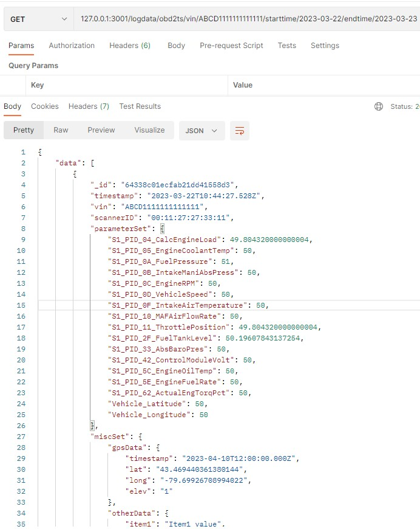

### (9) /obd2ts/create
Method: POST
- Input: JSON object with two items in the body of the request: 'auth' and 'data'. 'data' is an object of obd2ts schema. 'auth' is an object with 'userID' and 'userKey' fields.
- Output: An URL pointing directly to the newly created object.

### (10) /obd2ts/update
Method: POST
- Input: JSON object with two items in the body of the request: 'auth' and 'data'. 'data' is an object of obd2ts schema. 'auth' is an object with 'userID' and 'userKey' fields.. The 'data' object must have the _id artribute 
- Output: An URL pointing directly to the updated object.

### (10) /obd2ts/delete/:id
Method: GET
- Input: HTTP Param, id 
- Output: Simple message, "Parameter deleted".
- 